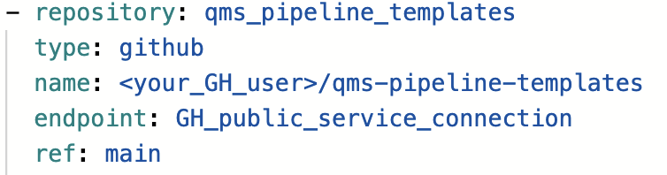

## CONTRIBUTORS ZONE - Submitting a PR to the QMS Team 

> NOTE: We use [conventional commits](https://www.conventionalcommits.org/en/v1.0.0/), which means [semantic commit messages](https://gist.github.com/joshbuchea/6f47e86d2510bce28f8e7f42ae84c716). Please adhere to these prefixes. Pull requests must also have a semantic prefix, e.g. 'feat:' or 'fix:'. If you are doing multiple changes at once, you are probably doing too much at once. Opt for smaller but more pull requests.

1. Fork this repo. 
2. Change the code and commit to the main of your forked repo
3. Edit the main yaml of your QMS flow and edit the GtHub service connection to
   look like this:

4. Rerun your flow and test the code changes fix your issue or implement your
   feature.
5. Possible take a couple of screenshots for documenting the change
6. Create a PR, append evidence and notify the [QMS TEAM](https://docs.qms.novonordisk.cloud/Guides/reference/QMS_team)

# QMS TEAM ZONE - Publishing new version
 
1. QMS team reviews the PR
2. Merge the PR to main
3. Run the ADO pipeline nightly flow or wait for the day after to check that
   the changes didn't impact the newest cli functionality
4. Point to new qms-pipelines templates in cli and bump the version as in this
   [guide](https://github.com/nn-dma/qms-pipeline-templates?tab=readme-ov-file#point-to-latest-qms-pipeline-templates-tag-and-publish-a-new-qms-cli) 
5. Thank the contributor(s) and inform them that their changes are availble at
   the latest tag
