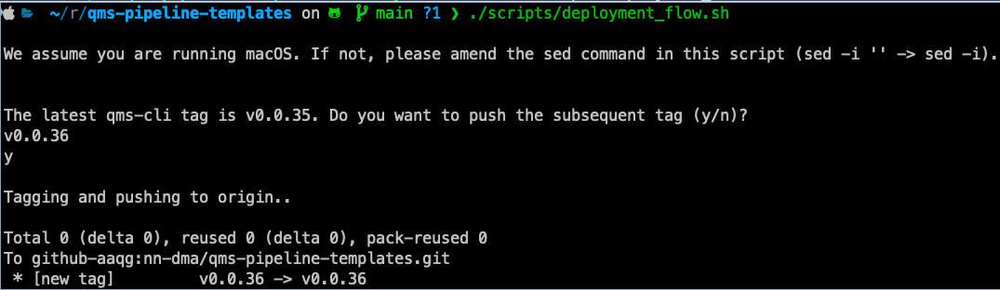

# Automated release of Pipeline Templates 

## Publish the latest cli version

After you applied the changes to main or you merged a PR, you will need to run
the following:

```
./scripts/deployment_flow.sh
```

The script will first warn the user that, in case you are running Linux, you'll need to modify the script:

```
We assume you are running macOS. If not, please amend the sed command in this script (sed -i '' -> sed -i).
```

The script will ask to confirm the newest tag in the qms-pipeline-templates repo:
 
```
The latest qms-cli tag is v0.0.35. Do you want to push the subsequent tag (y/n)?
v0.0.36
```

Answer y, if you are fine with the new tag, otherwise enter n and provide a new
tag. Here is a sample output of the script:



